# MediAssist

Application mobile pour la gestion et le suivi des médicaments

<p align="center">
  
</p>

## Description

MediAssist est une application mobile développée pour faciliter la gestion des médicaments et des rendez-vous médicaux. Elle permet aux utilisateurs de suivre leurs traitements, de recevoir des rappels pour la prise de médicaments, de gérer leurs rendez-vous médicaux et d'accéder rapidement à des contacts d'urgence.

## Fonctionnalités principales

- **Gestion des médicaments**: Ajout, modification et suivi des médicaments avec dosage et fréquence
- **Notifications**: Rappels personnalisés pour la prise de médicaments
- **Rendez-vous médicaux**: Planification et suivi des consultations
- **Profil utilisateur**: Stockage sécurisé des informations médicales personnelles
- **Contacts d'urgence**: Accès rapide aux numéros importants en cas d'urgence
- **Gestion des ordonnances**: Importation et stockage numérique des prescriptions médicales
- **Assistant virtuel**: Chatbot intégré pour répondre aux questions relatives à la santé

## 🛠Technologies utilisées

- **Java**: Langage de programmation principal
- **XML**: Conception des interfaces utilisateur
- **SQLite**: Base de données locale pour le stockage des informations
- **Android SDK**: Développement natif Android

## Captures d'écran

<div style="display: flex; flex-wrap: wrap; justify-content: space-between;">
  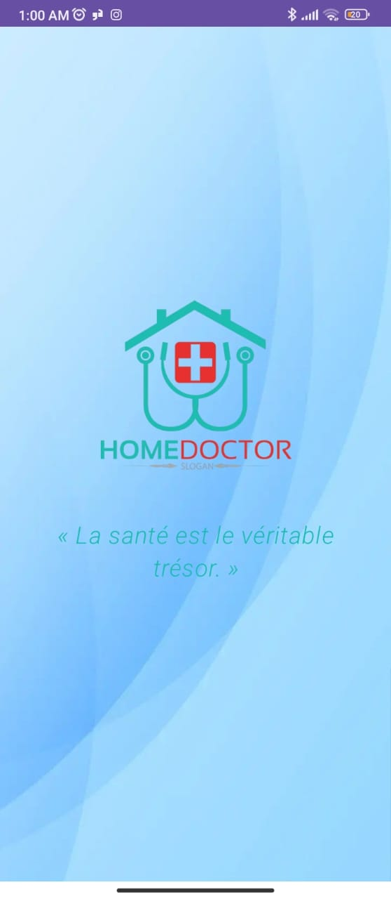
  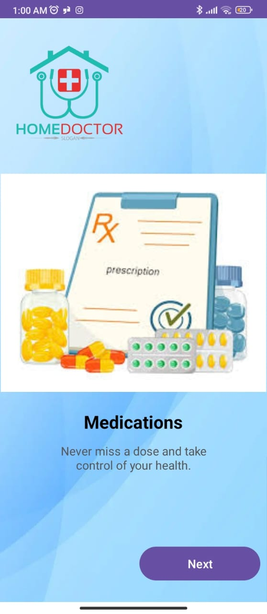
  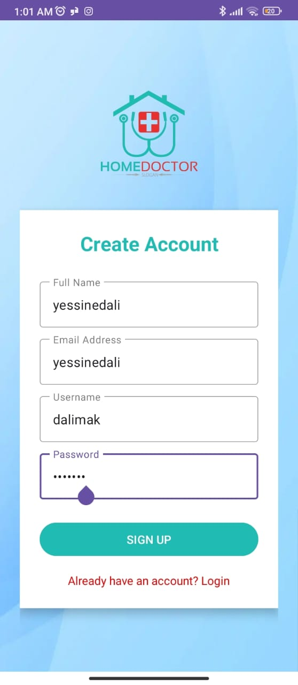
  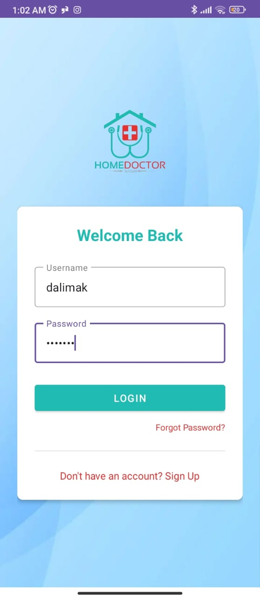
</div>

<div style="display: flex; flex-wrap: wrap; justify-content: space-between; margin-top: 10px;">
  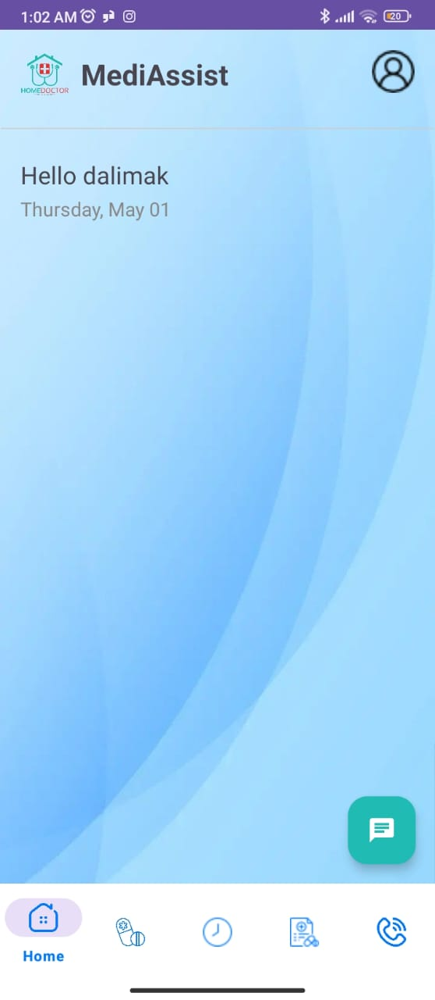
  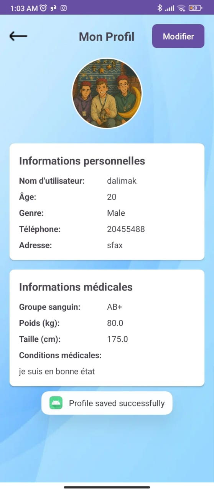
  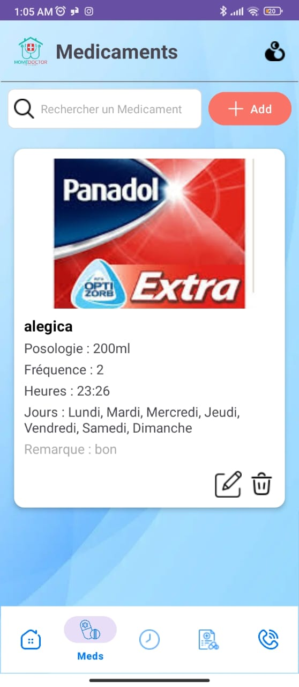
  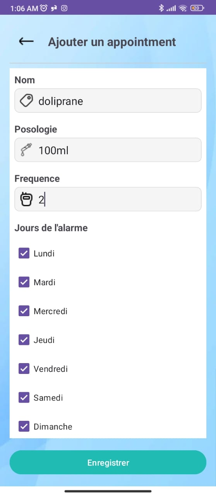
</div>

<div style="display: flex; flex-wrap: wrap; justify-content: space-between; margin-top: 10px;">
  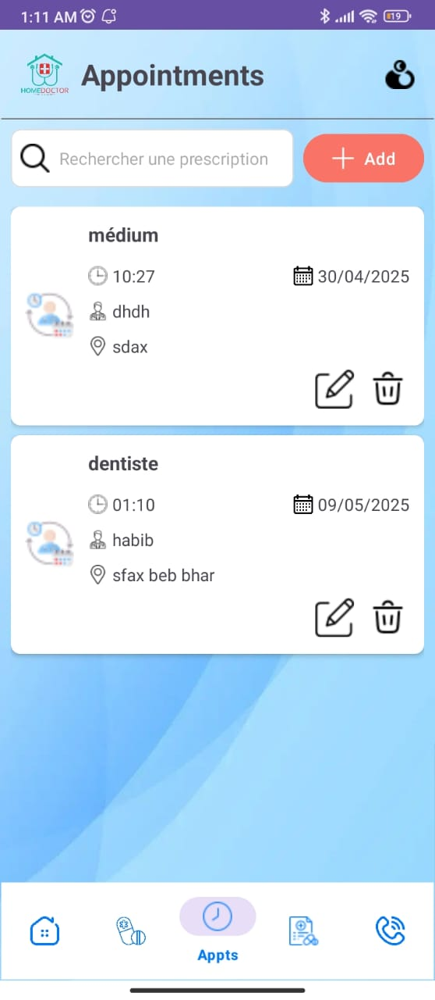
  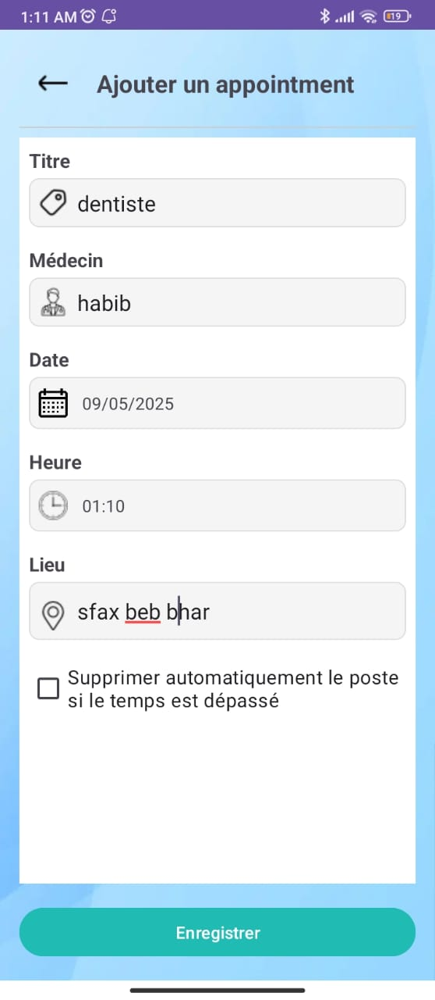
  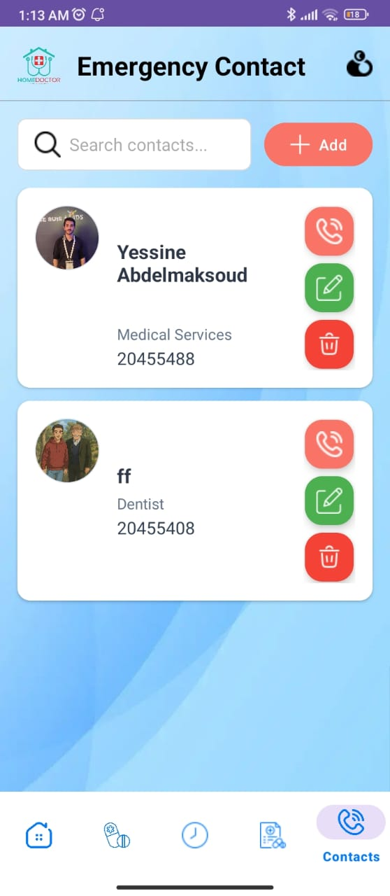
 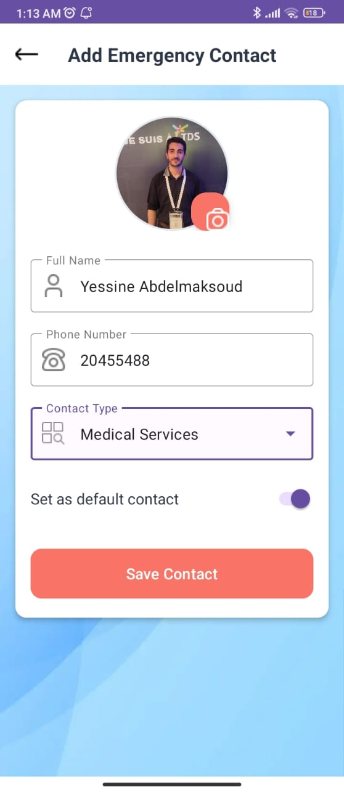

</div>

<div style="display: flex; flex-wrap: wrap; justify-content: space-between; margin-top: 10px;">
  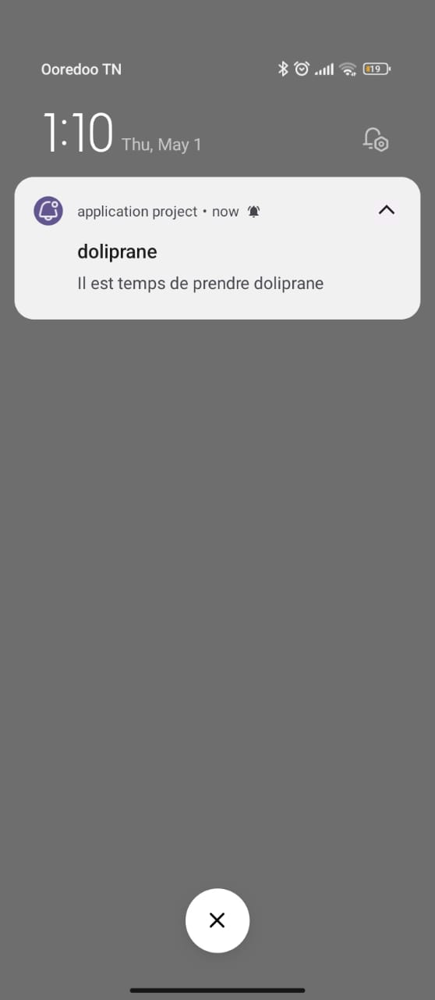
  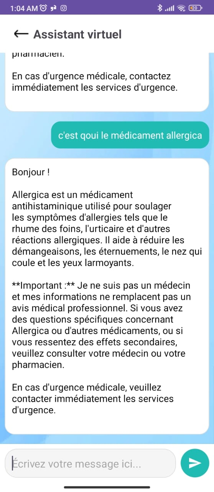
   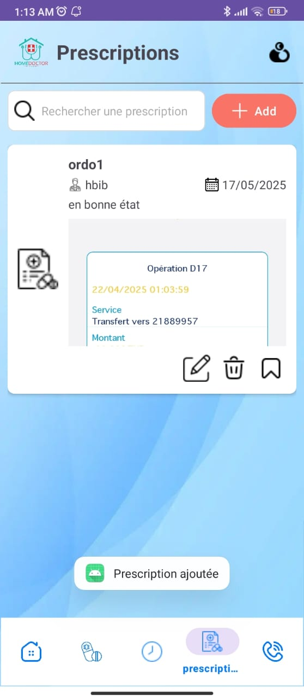
    

 
</div>

## 🎬 Démonstration vidéo

[Regarder la démonstration complète](https://youtu.be/lien-vers-video)


## 🚀 Installation

1. Clonez ce dépôt
   ```
   git clone https://github.com/yessineabdelmaksoud/MediAssist
   ```

2. Ouvrez le projet dans Android Studio

3. Synchronisez le projet avec Gradle

4. Exécutez l'application sur un émulateur ou un appareil physique

## 📝 Base de données

L'application utilise SQLite pour stocker les données localement sur l'appareil. Voici les principales tables :

- **Users**: Informations du profil utilisateur
- **Medications**: Détails des médicaments
- **Appointments**: Informations sur les rendez-vous
- **EmergencyContacts**: Contacts d'urgence
- **Prescriptions**: Données des ordonnances

## 👥 Équipe

- Yessine Abdelmaksoud
- Mohamed Ali Abid
